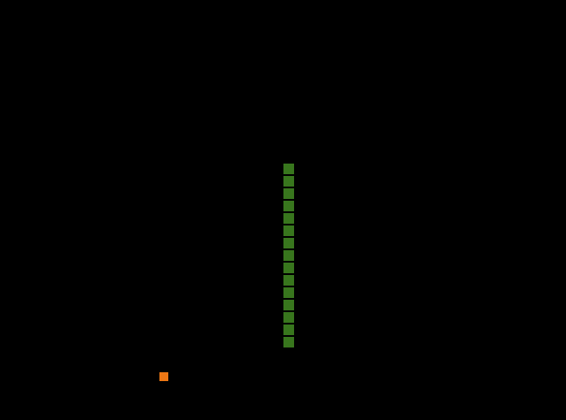

# SNAKE

## the goal
Eat 500 food objects to win. Do not slither into yourself or off the screen.

## the controls
- `w` = up
- `a` = left
- `s` = down
- `d` = right

You can also just change the keybinds in the source code if you dont like them.

## acquisition
- Install a c compiler like [gcc](https://gcc.gnu.org/install/)
- Have SDL on your include path
- Run the commands in [tasks.json](.vscode/tasks.json) or the [Makefile](Makefile)
- Windows binaries will be in releases.

